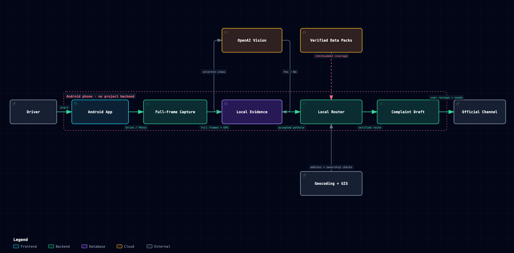

# Pothole Reporter

Around 2,000 people a year die on Indian roads because of potholes, and many more
lose hours to them. Most of those potholes are already someone's job to fix, often
under a contract still in warranty. The gap is that nobody reports them to the right
person with enough detail to act on.

This app closes that gap. Mount your phone, drive, and it finds reportable road damage,
distinguishing a pothole cavity from a failed repair, surface breakup or depression,
works out which officer is responsible, finds the road contract they were built
under, and writes the complaint. You read it and press send.

The aim is to get roads repaired, so that fewer people are hurt and fewer hours are
lost sitting in traffic that a good road surface would not have created. It is not
written against anyone. Officers and contractors have a difficult job and a large
city to keep up with; a complaint that arrives with a photograph, exact coordinates,
the right office and the relevant contract is simply easier to act on than one that
does not. That is the whole idea.

**It works in Karnataka today.** The officer directory, the road contracts and the
boundary data are all Karnataka's. A pothole anywhere else is photographed and saved, but
the app will not name a recipient it cannot verify, so it refuses rather than sending your
complaint to the wrong office. Other states are the next piece of work, not a solved one.

No server, no backend, no credentials in the APK. Everything runs on the phone.



## A real one it caught

Not an illustration. This photo, this output, from the app on a phone.


| | |
|---|---|
| Verdict | **medium pothole cavity**, clear assessment |
| Address | 17th Main Road, HSR Layout, Bengaluru, 560102 |
| Routed to | Commissioner, Bengaluru South City Corporation |
| Probable contract | `BBMP/2025-26/OW/WORK_INDENT7739`, SOMANATH MALLAPPA HUNDRE |

And the complaint it drafted:

```text
Dear Commissioner, Bengaluru South City Corporation (BSCC),

I would like to report a pothole that needs repair.

Location: 17th Main Road, HSR Layout, Bengaluru, 560102
Coordinates: 12.911500, 77.642700
Map link: https://maps.google.com/?q=12.911500,77.642700
Approximate size: medium

PFA image. This pothole poses a danger to two wheeler riders and other road users. I request the city corporation to inspect and repair it at the earliest, and to route it to the contractor responsible if this road section is still under a maintenance warranty.

Public procurement records indicate this road stretch probably falls under tender BBMP/2025-26/OW/WORK_INDENT7739 ("Pothole Filling Works under Maintenance Works in Ward No.221 - HSR Layout."), published on 23-06-2025, with SOMANATH MALLAPPA HUNDRE recorded as the winning bidder, and it may still be within the maintenance period.

If the defect liability or maintenance period is in force, I request that the repair be carried out by the contractor at no additional cost to the corporation. This is a probable record match; kindly verify against the tender documents.

Thank you for your service to the city.

Regards,
Gaurav Sen
```

Captured from the app on a phone on 20 August 2026. The name at the end is whatever you
set in Settings. The current detector deliberately does not show a language model's
uncalibrated percentage as if it were probability.

That last paragraph is the point. A pothole on a road still under warranty should be
repaired by the contractor at no further cost to the public.

## Use it

1. **Install.** Download `PotholeReporter.apk` from the
   [Releases page](https://github.com/coding-parrot/pothole-reporter/releases) and
   sideload it. Paste an OpenAI API key on first launch, allow camera and location.
2. **Drive.** Mount the phone so the travelled road fills the orange guide and tap Drive
   Mode. Sampling targets about six metres. Each event uses a three-frame burst, keeps the
   sharpest frame as evidence, and sends full context plus ordered road crops in one request.
   Capture continues into a bounded queue while cloud checks are busy.
3. **Or point and shoot.** Tap Report road damage for a defect you have stopped at.
4. **Read the draft, press send.** Each confirmed road-damage event becomes an email draft with
   the photo, address, coordinates, officer and probable contract. The app never sends
   anything itself.
5. **Check your map.** Your contribution shows every pothole you have reported,
   kilometres covered, and which drafts you sent.

Settings has English and Kannada, and a debug mode that keeps the drive video so you
can re-analyse it later.

## Who receives them

The app asks Karnataka's state GIS which body owns the road, then addresses its head.

- **City corporation** goes to the Commissioner, **council or town panchayat** to the
  Chief Officer. 182 of the state's 319 bodies, including all 18 corporations and the
  five that replaced BBMP in 2025.
- **National highways are refused.** NHAI or the PWD highways division maintains them,
  not the town they cross. About 1,450 km of NH runs inside Karnataka's town boundaries.
- **Rural roads are refused** and name the gram panchayat, rather than guessing an office.
- **Outside Karnataka, or a body with no published address, is refused.** A complaint to
  the wrong office is worse than no complaint.

Email is a contact channel, not a tracked one. For a ticket number, also file on Sahaaya 2.0.

## Contracts

The APK bundles 42,283 awarded road-work contracts from KPPP, Karnataka's procurement
portal. When a match clears a confidence gate, the complaint names the tender.

- **Only the officer's own works count.** A Commissioner cannot enforce a state PWD,
  panchayat or irrigation contract, so 28,706 of the 42,283 rows can never be named in
  their letter, leaving 13,577 that can.
- **1,124 contracts name a contractor.** The portal's search results omit the winning
  bidder, so elsewhere the complaint says plainly that none is recorded.
- **Warranty is inferred from the publication date**, since award records carry no defect
  liability period. It is always stated as a possibility, never a fact.

Every source is documented with commands to verify it in [docs/SOURCES.md](docs/SOURCES.md).
Refresh with `python3 tools/pull-kppp.py`.

## Cost

Every sampled event is an API call on your key and can contain four image views. A city
drive costs rupees. A long
one costs more, because there is no cheap pre-filter: one was tried and it rejected
most real potholes, so it was removed.

Detection defaults to `gpt-5-mini` / `high` while a trustworthy v3 benchmark is being
collected. Settings exposes `gpt-5.6` / `original` as an accuracy experiment, but neither
configuration should be called more accurate until a held-out, fully human-labelled
drive benchmark shows a real gain. The evaluator and data requirements are documented
in [`eval/README.md`](eval/README.md).

## Where this is going

- **Every major Indian city.** Karnataka works today. Mumbai, Delhi, Hyderabad,
  Chennai and Pune each need their own officer directory and tender source, and Delhi
  needs road-ownership data that splits by carriageway width. The remaining 137
  Karnataka bodies need addresses their district sites do not publish.
- **A background camera app.** Capture should not require the app in the foreground
  with the screen awake. That needs a native camera service, which is real work but
  is what makes this usable on an ordinary commute.
- **No API key.** A hosted service so anyone can report a pothole without opening a
  billing account, with the operator's key behind attestation, per-device quotas and
  a spend ceiling. Built, on the `server-backed` branch, not yet live.

## Development

`static/index.html` is the UI and `static/standalone.js` is the whole engine. Copy
both into `android-app/www/`, then `npx cap sync android` and `./gradlew
assembleDebug`. To test in a browser, serve `android-app/www/` and open
`http://localhost:8765/#key=sk-...` in Chromium with `--disable-web-security`. The
fragment is removed immediately and, unlike a query string, is never sent to the HTTP
server or written to its access log.

`eval/` holds the detection benchmark and, more usefully, a log of the accuracy
changes that were tried and rejected, with the evidence.

## What leaves your phone

Every photo the app checks is sent to OpenAI for detection, so it is processed outside
India. Road photographs routinely contain number plates, faces and shopfronts, and none of
that is blurred before it is sent. Coordinates go to OpenStreetMap to resolve an address
and to Karnataka's state GIS to find the responsible body. The API key and every report
stay on the device.

There is no server and no account, so this project collects nothing. That is a deliberate
choice, not only a simplification: with everything on-device, no operator ever holds your
name, your location history or your photographs.

## Disclaimer

Contract matches are probabilistic and always worded as a probable match to verify;
keep that wording. The app never sends email. Every complaint is sent by you, from
your account, and you are responsible for its contents. Not legal advice, and not
affiliated with GBA, BBMP or any government body.

## Credits

Contracts from [KPPP](https://kppp.karnataka.gov.in), the Karnataka Public Procurement
Portal, with contractor names from the public-domain snapshot at
[bengaluru-road-contracts.pages.dev](https://bengaluru-road-contracts.pages.dev).
Boundaries from [KGIS](https://kgis.ksrsac.in), run by KSRSAC. Officer addresses from
district NIC sites and the bodies' own sites. Geocoding by OpenStreetMap Nominatim, maps
by [Leaflet](https://leafletjs.com). Detection and drafting by OpenAI vision models.
Full provenance in [docs/SOURCES.md](docs/SOURCES.md).

## License

MIT. See [LICENSE](LICENSE).
