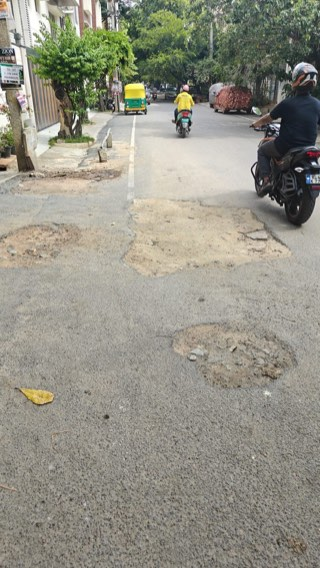
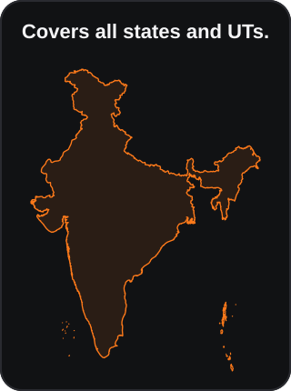

# Pothole Reporter

An independent Android app for potholes, garbage, and open or damaged manholes. **Drive**
detects visible road damage; **Photo** lets the user choose the issue and prepares evidence
for an official complaint channel. Reports remain on the phone, and nothing is filed
automatically. There is no project-operated backend or account system.

Current release: [v1.33.0](https://github.com/coding-parrot/pothole-reporter/releases/tag/v1.33.0)

<p>
  <a href="docs/example-pothole.jpg"></a>
  <a href="docs/coverage-overview.svg"></a>
</p>

<sub>Example detection and current coverage summary. Select either image to enlarge it.</sub>

## Coverage

| Area | Current scope and handoff |
| --- | --- |
| National Highways | Potholes only, on operational NH/NE carriageways mapped in the pinned 20 August 2026 OpenStreetMap extract. Matches open Rajmargyatra/1033; the maintainer is not guessed. |
| 50 largest population centres | All 50 from Census 2011 A-04(I). Existing reviewed/statewide routes stay preferred; 13 centres require both a conservative coordinate envelope and an exact structured city/state match before offering a neutral official grievance channel. Markers do not claim complete Urban Agglomeration boundaries. |
| Delhi | Full Delhi NCT. Road damage uses PWD Sewa; garbage and manholes use CM JanSunwai. NCR places outside NCT never inherit Delhi's route; Noida and Ghaziabad can qualify through the separate Uttar Pradesh route, while Faridabad retains its top-50 neutral route. |
| Maharashtra | Full state coverage. Verified MMR and PMC polygons keep their specific routes; every other Maharashtra point uses Aaple Sarkar, with MahaULB offered for urban areas. The app does not guess the local body or road owner. |
| West Bengal | Full state coverage. The verified KMC polygon keeps KMC Grievance 2.0; every other West Bengal point uses the neutral West Bengal PGRS handoff, with CMO Grievance as an alternate. The user must select and verify the district or department. |
| Punjab | Full state coverage through Connect Punjab, with mSeva offered for urban areas. Chandigarh is outside the Punjab boundary. The user must select and verify the department or local body. |
| Karnataka | Full state coverage. Verified urban-body and Bengaluru routes stay preferred; every other confidently contained point uses the neutral Janaspandana iPGRS handoff, with Janahitha offered as an urban alternate and 1902 as the grievance helpline. The app does not guess the department, local body, or road owner. |
| Kerala | Full state coverage through the neutral Kerala CMO grievance portal, with K-SMART offered for local-body issues. Help/status line 1076 does not accept complaints by phone. Mahe is outside the Kerala boundary. The user must select and verify the department or local body. |
| Tamil Nadu | Full state coverage. The exact Greater Chennai Corporation route stays preferred; every other confidently contained Tamil Nadu point uses the neutral Mudhalvarin Mugavari grievance service. Puducherry and Karaikal are excluded. |
| Andhra Pradesh | Full state coverage through the statewide PGRS service, with CDMA/Puramithra offered for urban areas. Yanam is excluded. The app does not guess the local body or road owner. |
| Telangana | Full state coverage through neutral Telangana Prajavani, with Citizen Buddy offered for municipal areas outside Hyderabad. Verified Hyderabad CURE points keep the specific My Cure route; Secunderabad Cantonment is excluded from My Cure but can use neutral Prajavani. The app does not guess the local body or road owner. |
| Uttar Pradesh | Full state coverage through the neutral Jansunwai–Samadhan handoff and helpline 1076. Delhi NCT keeps its separate exact route. The user must select and verify the district, department, local body, category, and road owner. |
| Chhattisgarh | Full state coverage through the neutral CM Helpline handoff and helpline 1076, with NIDAAN 1100 offered for urban civic issues. The user must select and verify the district, department, local body, category, and road owner. |
| Rajasthan | Full state coverage through Rajasthan Sampark 2.0 and helpline 181. National Highways keep the Rajmargyatra/1033 route. The user must select and verify the district, department, local body, category, and road owner. |
| Gujarat | AMC CCRS for a reviewed 48-ward Ahmedabad footprint (439.397 km²). Wider AUDA is excluded, and complete recent outer-expansion coverage is not claimed. |

Boundaries suggest a complaint route; they do not prove who owns or maintains a road.
The user must review and complete every complaint in the offered official app, portal,
WhatsApp, dialler, share sheet, or email client. Nothing is submitted automatically.

## How it works

- **Drive** shows a live road view and counters. Its Android foreground service keeps scanning—and, when explicitly enabled, recording silent local video—under a truthful persistent notification while Maps or a call is open.
- **Photo** offers **Pothole**, **Garbage**, or **Manhole**. Pothole photos use AI; the
  other two are explicit user reports and are not sent to OpenAI.
- OpenAI vision assesses visible potholes, failed patches, breakup, ruts, and depressions.
- Nearby repeat observations are grouped into one report; Debug mode retains each one.
- On a later live drive, **Fixed** requires a separate before/after AI check that clearly
  sees the same footprint covered by completed, intact repair material. Probable,
  obstructed, mismatched, or merely clean-looking views remain open for review.
- The app preserves the photo, coordinates, time, category, complaint draft, and official
  reference ID locally. A genuinely temporary routing-data failure can be retried later;
  permanent boundary/category refusals require a new report or added coverage.
- Garbage and manhole handoffs are enabled throughout Maharashtra, West Bengal, Punjab, Karnataka, Kerala, Tamil Nadu, Andhra Pradesh, Telangana, Uttar Pradesh, Chhattisgarh, and Rajasthan,
  plus all accepted top-50 city routes. Road damage keeps its road-specific channel where one exists.
- English, Kannada, Marathi, and Bengali are supported.

### National Highway routing

- Runs before municipal routing anywhere in India.
- Uses 101 checksum-pinned tiles containing 680 NH/NE references from the pinned
  20 August 2026 OpenStreetMap India extract.
- Refuses weak GPS, conflicting direction, nearby different highway references, missing
  tiles, and altered data instead of guessing.
- Opens Rajmargyatra or 1033 and asks the official service to identify the maintaining
  NHAI, NHIDCL, BRO, or State PWD unit.

## Downloaded data packs

The APK contains the app and small manifests, not the large reference datasets. When
needed, it downloads a versioned state pack or the relevant 2° National Highway tile from
this project's GitHub Pages site. Highway matching runs before municipal routing. The
101 highway tiles total about 18 MB, but only the relevant tile is downloaded and cached;
they do not enlarge the APK. The optional Karnataka tender pack is downloaded only for
eligible contract matching. It contains only titles with explicit carriageway work;
drain-, footpath-, sewer-, and other roadside-only contracts are excluded even when a
road name appears as their location.

Every downloaded pack is checked byte-for-byte against a checksum pinned in the app before
it is used, then cached locally. Missing, malformed, or altered required routing, contact,
or highway data makes authority routing fail closed—the app does not guess or reuse
unverified data.
If the optional Karnataka tender pack is unavailable, the report continues without a
contract match. A verified cached pack is available after its first successful download,
although detection, geocoding, and Karnataka GIS still need their respective network
services. On a subsequent pack use, caches past their unused limits are pruned
automatically; **Delete all app data** removes the entire pack cache immediately.

A pack request contains no report, photo, or exact coordinates. GitHub Pages can receive
the device's IP address, connection metadata, and requested pack URL; the URL reveals a
state or an approximate 2° highway tile. See the
[privacy policy](https://coding-parrot.github.io/pothole-reporter/privacy.html).

## Install

1. Install the APK attached to the
   [latest release](https://github.com/coding-parrot/pothole-reporter/releases/latest).
2. For Pothole or Drive, enter your OpenAI API key. Garbage and Manhole do not need it.
   Allow camera and location access; Drive also needs notification access.
3. Capture while safely stopped, or securely mount the phone before starting **Drive**.
4. Review the image, location, authority, wording, and any probable contract match before
   choosing an external complaint channel.

## Important limits

- AI can miss damage or produce false positives. No field-validated accuracy percentage is
  claimed.
- Android may temporarily take the camera for a video call or another higher-priority app;
  Drive pauses camera sampling and resumes automatically. Normal audio calls do not require
  the camera. Device-specific battery managers can still stop long-running services.
- Selected road-damage images and the user's API key go directly to OpenAI. Garbage and
  manhole photos do not. Exact coordinates go to OpenStreetMap Nominatim; Karnataka
  locations query Karnataka GIS, and exact Hyderabad CURE checks query Telangana GIS. Maharashtra,
  West Bengal, Punjab, Karnataka, Kerala, Tamil Nadu, Andhra Pradesh, Telangana, Uttar Pradesh, Chhattisgarh, and Rajasthan containment is checked locally against downloaded ODbL state boundaries.
  The 13 structured-city routes require Nominatim's city/municipality and state fields;
  a broad envelope or stale place label alone cannot select a route.
- Contract matching is optional and available only for eligible Karnataka routes. A match
  is not proof that a contractor or warranty applies. Only explicit carriageway-work
  scope can enter the matcher; mixed work must state the road work separately.
- National Highway coverage follows mapped NH/NE geometry, not the legal road register.
  Parallel roads, junctions, weak GPS, missing tiles, and altered data fail closed.
- The project is not affiliated with or endorsed by a government body or data provider.

Read [data sources and limits](https://coding-parrot.github.io/pothole-reporter/sources.html)
for exact coverage, provenance, and known gaps.

## Build and test

```bash
./tools/build-apk.sh
./tests/run-all.sh
# Explicit live-service checks: RUN_LIVE_TESTS=1 ./tests/run-all.sh
```

## License

Code is MIT; data retains its source licences and terms. See [LICENSE](LICENSE) and
[data sources and limits](https://coding-parrot.github.io/pothole-reporter/sources.html).
